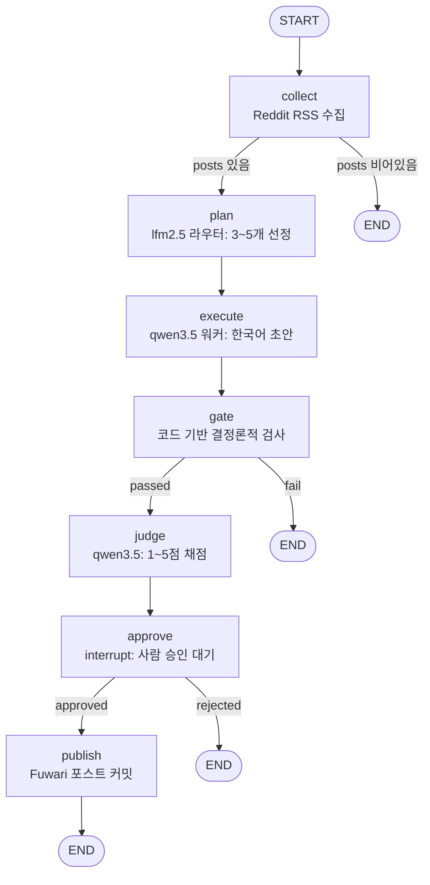
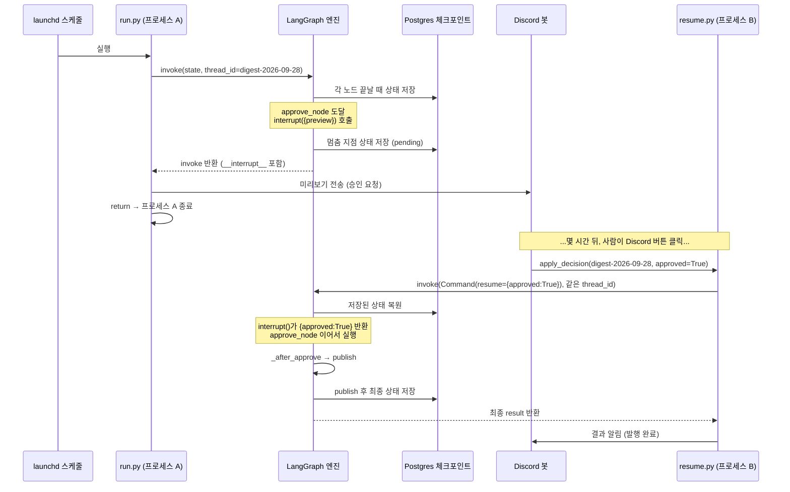

# LangGraph, 이 프로젝트 코드로 처음부터 배우기

이 문서는 reddit-orchestrator를 만든 당신(오너)을 위한 것입니다. AI의 도움으로
코드는 돌아가게 만들었지만, "LangGraph가 정확히 무슨 일을 하는지"는 아직 손에 잡히지
않는 상태를 가정합니다. 그래서 개념을 먼저 쉬운 말로 설명하고, **바로 이 저장소의
진짜 코드**(`graph.py`, `nodes.py`, `state.py`, `run.py`, `resume.py`)를 붙여서
보여줍니다. 학술적인 설명은 피하고, 최대한 구체적으로 갑니다.

---

## 0. 한눈에 보는 전체 그림

우리 파이프라인은 7개의 단계(노드)로 이루어진 하나의 그래프입니다.



이 그림은 그냥 예쁜 다이어그램이 아니라, `graph.py`가 코드로 선언한 것과 **1:1로**
대응합니다. 아래에서 그 코드를 한 줄씩 뜯어봅니다.

---

## 1. LangGraph란 무엇이고, 왜 쓰는가

### 그냥 파이썬 스크립트로 하면 안 되나요?

7단계를 함수로 만들어서 순서대로 호출하는 스크립트를 상상해 봅시다.

```python
posts = collect()
plan = plan(posts)
draft = execute(plan)
gate = run_gates(draft)
if not gate["passed"]:
    return
judge = judge(draft)
# ... 여기서 사람 승인을 기다려야 하는데?
publish(draft)
```

마지막 줄에서 막힙니다. **사람의 승인**을 기다려야 하는데, 스크립트는 그냥 실행되고
끝나버립니다. 승인을 기다리려면:

- 프로세스가 살아 있으면서 무한정 대기하거나 (Mac mini가 재부팅되면 다 날아감),
- 지금까지 만든 `posts`, `plan`, `draft`, `judge` 같은 **중간 상태를 전부 어딘가에
  저장**해 뒀다가, 나중에 다른 프로세스(Discord 봇, resume CLI)가 그걸 다시 불러와서
  이어서 실행해야 합니다.

이 "중간 상태 저장 → 나중에 다른 프로세스에서 이어서 실행"을 손으로 짜면 지옥입니다.
어디까지 실행됐는지 추적하고, 상태를 직렬화하고, 다시 로드하고, 정확히 그 지점부터
재개하는 코드를 전부 직접 만들어야 하죠.

### LangGraph가 해결하는 것

LangGraph는 **상태를 가진(stateful) 그래프 실행 엔진**입니다. 우리가 하는 일은:

1. **상태(State)**가 어떻게 생겼는지 선언한다 (`state.py`).
2. 각 **노드(node)**를 함수로 짠다 (`nodes.py`).
3. 노드들을 어떤 순서로, 어떤 조건에서 연결할지 **그래프(graph)**로 그린다 (`graph.py`).

그러면 LangGraph가 알아서:

- 상태를 노드 사이로 흘려보내고,
- 조건에 따라 분기하고,
- **중간 상태를 Postgres에 체크포인트로 저장하고**,
- `interrupt()`에서 **깔끔하게 멈췄다가**, 나중에 `Command(resume=...)`로 **정확히
  그 지점부터 재개**해 줍니다.

이게 우리 프로젝트의 핵심 요구사항(무인 자동 실행 + 승인 단계에서만 사람 개입 +
재부팅에도 살아남기)에 정확히 들어맞습니다.

### LangChain과는 다른가요?

- **LangChain**은 "LLM 호출, 프롬프트 템플릿, 도구 연결" 같은 부품 모음(라이브러리)에
  가깝습니다. 여러 호출을 체인처럼 이어 붙이는 데 강합니다.
- **LangGraph**는 그 위에서 **제어 흐름(control flow)**을 다룹니다. 분기, 반복, 멈춤/재개,
  상태 지속(persistence) 같은 "언제 무엇을 실행할지"를 담당합니다.

우리 프로젝트는 LangChain을 거의 쓰지 않습니다. LLM 호출은 `Gateway`(`gw`)가 Ollama/MLX로
직접 하고, LangGraph는 순수하게 **파이프라인의 흐름과 멈춤/재개**를 담당합니다. 실제로
`nodes.py`의 import는 아래처럼 단출합니다.

```python
from langgraph.types import interrupt      # nodes.py
```

`graph.py`도 딱 이것뿐입니다.

```python
from langgraph.graph import END, START, StateGraph   # graph.py
```

---

## 2. 핵심 개념 6가지 (설명 → 우리 코드)

### 2-1. State (TypedDict): 노드들이 공유하는 하나의 딕셔너리

**개념.** 상태는 그래프 전체가 공유하는 하나의 딕셔너리입니다. 각 노드는 이 딕셔너리를
읽고, 자기가 만든 결과를 여기에 채워 넣습니다. `collect`가 `posts`를 채우면, `plan`은
`state["posts"]`를 읽을 수 있죠. TypedDict로 선언하는 이유는 "이 딕셔너리에 어떤 키가
들어갈 수 있는지"를 타입으로 명시해서, 에디터 자동완성과 오타 방지를 얻기 위함입니다.

**우리 코드** (`state.py` 전체):

```python
import operator
from typing import Annotated, Any, TypedDict


class OrchestratorState(TypedDict, total=False):
    run_id: int
    digest_key: str
    posts: list[dict]        # collected candidates
    plan: dict               # DigestPlan
    draft: str               # markdown
    gate: dict               # deterministic gate result
    judge: dict              # JudgeVerdict
    approval: dict           # {approved, by}
    publish: dict            # publish result (path, committed, pushed, url)
    # steps accumulate across nodes (reducer), forming the per-run evidence trail.
    steps: Annotated[list[dict[str, Any]], operator.add]
    status: str
```

- `total=False`는 "모든 키가 항상 존재하지는 않는다"는 뜻입니다. 실행 초반에는 `draft`나
  `judge`가 아직 없죠. 그래서 노드 안에서 `state.get("posts")`처럼 `.get()`을 자주 씁니다.
- 각 키가 파이프라인 단계 하나의 산출물과 대응합니다: `posts`(수집) → `plan`(선정) →
  `draft`(초안) → `gate`(검사) → `judge`(채점) → `approval`(승인) → `publish`(발행).

### 2-2. Reducer: `steps`가 덮어쓰기가 아니라 "누적"되는 이유

**개념.** 노드가 상태의 어떤 키를 반환하면, 기본 동작은 **덮어쓰기(overwrite)**입니다.
`plan_node`가 `{"draft": "..."}`를 반환하면 기존 `draft`를 새 값으로 교체합니다. 그런데
어떤 값은 덮어쓰면 안 되고 **누적**되어야 합니다. 대표적인 게 우리의 증거 기록(`steps`)
입니다. 각 노드가 자기 실행 기록을 하나씩 남기는데, 이걸 덮어쓰면 마지막 노드 기록만
남고 나머지가 다 사라지겠죠.

여기서 등장하는 게 **reducer**입니다. `Annotated[타입, 합치는_함수]`로 선언하면,
LangGraph는 그 키를 덮어쓰는 대신 "기존 값과 새 값을 합치는 함수"로 병합합니다.

```python
steps: Annotated[list[dict[str, Any]], operator.add]
```

`operator.add`는 리스트 두 개를 `+`로 이어 붙이는 함수입니다. 즉 각 노드가
`{"steps": [한 개짜리 기록]}`을 반환하면, LangGraph가 내부적으로
`기존_steps + [새 기록]`을 해서 계속 이어 붙입니다.

**우리 코드** — 모든 노드가 이런 식으로 `steps`에 딱 하나씩만 넣어서 반환합니다:

```python
def collect_node(state):
    ...
    posts = collect(settings.subreddits)
    return {
        "posts": posts,
        "steps": [_step("collect", verdict=("ok" if posts else "empty"),
                        detail={"count": len(posts), "subreddits": settings.subreddits})],
    }
```

`_step()`은 단계 이름/모델/백엔드/토큰/지연시간/판정을 담은 딕셔너리를 만드는 헬퍼입니다:

```python
def _step(stage, res=None, verdict="ok", detail=None):
    return {
        "stage": stage,
        "model": res.model if res else None,
        "backend": res.backend if res else "code",
        "input_tokens": res.input_tokens if res else None,
        "output_tokens": res.output_tokens if res else None,
        "latency_ms": res.latency_ms if res else None,
        "verdict": verdict,
        "detail": detail or {},
    }
```

`collect`, `plan`, `execute`, `gate`, `judge`, `approve`, `publish` 각각이 `[한 개]`를
반환하지만, 실행이 끝나면 `state["steps"]`에는 7개(중간에 END로 빠지지 않았다면)가 순서대로
누적됩니다. 이 누적된 리스트가 그대로 `run_steps` 테이블에 저장되고, Spring Boot 대시보드가
단계별 지연/토큰/판정을 보여주는 원천 데이터가 됩니다.

> **기억할 점:** `posts`, `plan`, `draft` 같은 키는 **덮어쓰기**(reducer 없음). `steps`만
> **누적**(reducer 있음). 이 구분이 나중에 "왜 어떤 건 사라지고 어떤 건 쌓이지?"를 이해하는
> 열쇠입니다.

### 2-3. Node: 부분 상태를 반환하는 그냥 함수

**개념.** 노드는 `state`(현재 상태 딕셔너리)를 받아서, **바꾸고 싶은 부분만** 담은 딕셔너리를
반환하는 평범한 파이썬 함수입니다. 전체 상태를 다 반환할 필요가 없습니다. `{"draft": ...}`만
반환하면 LangGraph가 그 키만 상태에 병합해 줍니다.

**우리 코드** — `execute_node`는 초안만 만들어 반환합니다:

```python
def execute_node(state):
    plan = state["plan"]
    by_id = {p["reddit_id"]: p for p in state["posts"]}
    chosen = [by_id[i["reddit_id"]] for i in plan["include"] if i["reddit_id"] in by_id]
    ...
    res = gw.generate("worker", messages, options={"temperature": 0.4, "num_predict": 1200})
    return {"draft": res.text, "steps": [_step("execute", res, detail={"chars": len(res.text)})]}
```

- 입력: `state["plan"]`과 `state["posts"]`를 **읽습니다**.
- 출력: `{"draft": ..., "steps": [...]}`만 반환합니다. `draft`는 덮어쓰기, `steps`는 누적.
- 나머지 키(`posts`, `plan` 등)는 건드리지 않으니 그대로 유지됩니다.

`gate_node`는 LLM을 전혀 부르지 않고 코드로만 검사한다는 점을 주목하세요(그래서
`_step("gate", None, ...)` — 모델 없이 `backend="code"`):

```python
def gate_node(state):
    gate = run_gates(state.get("plan"), state.get("draft", ""), state["posts"])
    verdict = "pass" if gate["passed"] else "fail"
    return {
        "gate": gate,
        "status": "gated" if gate["passed"] else "rejected",
        "steps": [_step("gate", None, verdict=verdict, detail=gate)],
    }
```

이게 "judge를 부르기 전에 코드로 먼저 걸러서 토큰을 아낀다"는 설계가 코드로 나타난
모습입니다. 선정 유효성/중복/길이/금칙어를 코드로 검사해서 실패하면(fail closed) judge를
아예 호출하지 않습니다.

### 2-4. Edge vs 조건부 Edge: 흐름을 어떻게 잇는가

**개념.**
- **일반 엣지** `add_edge(A, B)`: "A가 끝나면 무조건 B로 간다."
- **조건부 엣지** `add_conditional_edges(A, 판정함수, 매핑)`: "A가 끝나면 판정함수를
  실행해서, 그 반환 문자열에 따라 다른 곳으로 간다." 우리의 gate/approve 분기가 여기에
  해당합니다.
- **START / END**: `START`는 그래프의 진입점, `END`는 종료 지점입니다. 어떤 노드에서 `END`로
  가면 그 실행 경로는 거기서 끝납니다.

**우리 코드** (`graph.py`의 `build_graph`):

```python
def build_graph(checkpointer=None):
    g = StateGraph(OrchestratorState)
    g.add_node("collect", collect_node)
    g.add_node("plan", plan_node)
    g.add_node("execute", execute_node)
    g.add_node("gate", gate_node)
    g.add_node("judge", judge_node)
    g.add_node("approve", approve_node)
    g.add_node("publish", publish_node)

    g.add_edge(START, "collect")
    g.add_conditional_edges("collect", _after_collect, {"plan": "plan", "empty": END})
    g.add_edge("plan", "execute")
    g.add_edge("execute", "gate")
    g.add_conditional_edges("gate", _after_gate, {"judge": "judge", "rejected": END})
    g.add_edge("judge", "approve")
    g.add_conditional_edges("approve", _after_approve, {"publish": "publish", "rejected": END})
    g.add_edge("publish", END)

    return g.compile(checkpointer=checkpointer)
```

읽는 법:
- `StateGraph(OrchestratorState)`: "이 그래프의 상태 모양은 `OrchestratorState`야."
- `add_node("이름", 함수)`: 노드 등록. 이름은 나중에 엣지에서 참조하는 문자열 키입니다.
- `add_edge(START, "collect")`: 시작하면 무조건 `collect`부터.
- `add_edge("plan", "execute")`: plan 끝나면 무조건 execute.
- 조건부 엣지 3개가 우리 그래프의 "갈림길"입니다.

**판정 함수**들은 그냥 상태를 보고 문자열을 반환하는 작은 함수입니다:

```python
def _after_collect(state) -> str:
    return "plan" if state.get("posts") else "empty"

def _after_gate(state) -> str:
    # Deterministic gate is the guard: fail closed (reject) before spending the judge.
    return "judge" if state["gate"]["passed"] else "rejected"

def _after_approve(state) -> str:
    return "publish" if state.get("approval", {}).get("approved") else "rejected"
```

반환한 문자열(`"plan"`, `"empty"`, ...)이 `add_conditional_edges`의 세 번째 인자인
**매핑 딕셔너리**의 키로 쓰여, 실제 목적지 노드(또는 `END`)로 번역됩니다. 예를 들어
`_after_gate`가 `"rejected"`를 반환하면 매핑 `{"judge": "judge", "rejected": END}`에 따라
`END`로 가서 실행이 끝납니다.

- `g.compile(...)`: 선언을 실제 실행 가능한 그래프 객체로 만듭니다. 여기서 **체크포인터**를
  넘겨주는 것이 다음 절의 핵심입니다.

### 2-5. Checkpointer (PostgresSaver): 상태를 디스크에 저장하기

**개념.** 체크포인터는 "각 노드가 끝날 때마다 현재 상태 스냅샷을 저장소에 기록하는
장치"입니다. 이게 있으면:

1. **재부팅에도 살아남습니다.** 승인 대기 중 Mac mini가 꺼져도, 상태는 Postgres에 있으니
   나중에 이어서 재개할 수 있습니다.
2. **다른 프로세스가 이어받을 수 있습니다.** `run.py`가 승인 지점에서 멈춘 뒤, 완전히 다른
   프로세스인 Discord 봇이나 `resume.py`가 같은 상태를 불러와 재개할 수 있습니다.
3. **`interrupt()`가 가능해집니다.** 멈췄다 재개하는 기능은 상태 저장 없이는 불가능합니다.

**thread_id가 핵심입니다.** 체크포인터는 상태를 `thread_id`라는 키로 구분해서 저장합니다.
"이 실행은 어느 대화/작업에 속하는가"를 나타내는 식별자죠. 우리 프로젝트는 **`thread_id`로
`digest_key`(예: `digest-2026-09-28`)를 씁니다.** 그래서 하루치 다이제스트 하나가
곧 하나의 스레드(하나의 저장된 상태 흐름)가 됩니다.

**우리 코드** (`run.py`):

```python
config = {"configurable": {"thread_id": digest_key}}   # 예: digest-2026-09-28
...
if use_db:
    from langgraph.checkpoint.postgres import PostgresSaver
    cm = PostgresSaver.from_conn_string(settings.database_url)
else:
    from contextlib import nullcontext
    cm = nullcontext(MemorySaver())        # --no-db 모드: 메모리에만, 재부팅하면 사라짐

with cm as cp:
    if use_db:
        cp.setup()                          # 최초 1회 필요한 테이블 생성
    graph = build_graph(checkpointer=cp)    # 여기서 체크포인터가 그래프에 주입됨
    state = {"digest_key": digest_key, "run_id": run_id}
    if seed is not None:
        state["posts"] = seed
    result = graph.invoke(state, config=config)   # config로 thread_id 전달
```

핵심 포인트:
- `PostgresSaver.from_conn_string(...)`로 Postgres 체크포인터를 만들고, `cp.setup()`으로
  체크포인트 저장용 테이블을 준비합니다(이미 있으면 넘어감).
- `build_graph(checkpointer=cp)`로 그래프에 체크포인터를 꽂습니다. 이걸 안 넘기면
  (`checkpointer=None`) 상태가 저장되지 않고, `interrupt()`도 제대로 동작하지 않습니다.
- `graph.invoke(state, config=config)`에서 `config`의 `thread_id`가 "이 실행을 어느
  스레드에 저장할지"를 정합니다.
- `--no-db`일 때는 `MemorySaver()`(메모리 전용)를 씁니다. 개발/테스트용이며, 프로세스가
  끝나면 상태가 사라져서 재개가 불가능합니다.

### 2-6. interrupt() / Command(resume=...): 사람이 개입하는 멈춤과 재개 — **가장 중요**

이 절이 이 문서의 심장입니다. 천천히 갑니다.

**문제.** judge까지 끝난 초안을 사람이 보고 승인/거절해야 합니다. 그런데 사람이 언제 답할지
모릅니다. 5분 뒤일 수도, 세 시간 뒤일 수도 있습니다. 그동안 프로세스를 붙잡고 기다릴 수
없습니다(자원 낭비 + 재부팅 위험).

**해결.** `interrupt()`를 호출하면 LangGraph는 **그 노드 실행을 그 지점에서 멈추고, 지금까지의
상태를 체크포인터에 저장한 뒤, `invoke()` 호출 자체를 리턴해 버립니다.** 프로세스는 정상적으로
끝납니다. 나중에 완전히 다른 프로세스에서 같은 `thread_id`로 `Command(resume=결정값)`을
넘겨 `invoke()`를 다시 부르면, LangGraph가 저장된 상태를 불러와 **바로 그 `interrupt()`
지점부터** 다시 실행합니다. 이때 `interrupt()`가 반환하는 값이 바로 우리가 넘긴 `결정값`
입니다.

**우리 코드** — 멈추는 쪽 (`nodes.py`의 `approve_node`):

```python
def approve_node(state):
    # Pause here (checkpointed) until a human resumes with a decision. The resume
    # value is what interrupt() returns; delivered by the Discord bot or resume CLI.
    decision = interrupt({
        "digest_key": state["digest_key"],
        "title": state["plan"].get("title"),
        "judge": state.get("judge"),
    })
    approved = decision.get("approved") if isinstance(decision, dict) else bool(decision)
    by = decision.get("by", "unknown") if isinstance(decision, dict) else "unknown"
    return {
        "approval": {"approved": bool(approved), "by": by},
        "status": "approved" if approved else "rejected",
        "steps": [_step("approve", verdict=("pass" if approved else "fail"), detail={"by": by})],
    }
```

여기서 두 가지 서로 다른 역할을 하는 데이터가 있습니다. 헷갈리기 쉬우니 분명히 합니다.

1. `interrupt(...)`에 **넣는** 딕셔너리(`digest_key`, `title`, `judge`)는 **바깥으로
   내보내는 미리보기 정보**입니다. 멈출 때 이 값이 `invoke()`의 반환값 안 `__interrupt__`에
   담겨 나갑니다. Discord로 "이 초안 승인할래?" 미리보기를 보낼 때 이걸 씁니다.
2. `interrupt(...)`가 **반환하는** `decision`은 **나중에 재개할 때 바깥에서 넣어주는 결정값**
   입니다. 처음 멈출 때는 이 줄에서 실행이 끊기고, 재개될 때 이 지점부터 다시 시작하면서
   `decision`에 재개값이 들어옵니다.

**우리 코드** — 멈춘 걸 감지하는 쪽 (`run.py`):

```python
def _is_interrupted(result: dict) -> bool:
    return "__interrupt__" in result
...
result = graph.invoke(state, config=config)

if _is_interrupted(result):
    _print_report(result)
    if use_db:
        _persist(run_id, result, status="pending_approval")
    notify.send_approval_request(digest_key, result.get("plan"), result.get("judge"),
                                 result.get("draft"), result.get("steps", []))
    if args.auto_approve:
        print("\n[auto-approve] resuming with approved=True")
        result = graph.invoke(Command(resume={"approved": True, "by": "auto"}), config=config)
    else:
        print(f"\n[awaiting approval] resume with: "
              f"python -m orchestrator.resume {digest_key} approve|reject")
        return   # ← 프로세스는 여기서 깔끔하게 종료됩니다
```

`invoke()`가 돌아왔을 때 결과에 `__interrupt__` 키가 있으면 "아, 승인 단계에서 멈췄구나"를
압니다. 그러면 DB에 `pending_approval`로 저장하고, Discord로 미리보기를 보낸 뒤, **그냥
`return`으로 프로세스를 끝냅니다.** 붙잡고 기다리지 않습니다.

**우리 코드** — 재개하는 쪽 (`resume.py`, Discord 봇과 resume CLI가 공통으로 쓰는 함수):

```python
def apply_decision(digest_key: str, approved: bool, by: str = "malgcheong") -> dict:
    config = {"configurable": {"thread_id": digest_key}}
    from langgraph.checkpoint.postgres import PostgresSaver
    with PostgresSaver.from_conn_string(settings.database_url) as cp:
        cp.setup()
        graph = build_graph(checkpointer=cp)
        result = graph.invoke(Command(resume={"approved": approved, "by": by}), config=config)
    ...
```

이게 마법의 핵심입니다. `resume.py`는:
- 같은 `thread_id`(`digest_key`)를 씁니다 → 어느 저장된 상태를 이어받을지 지정.
- 같은 Postgres 체크포인터를 붙입니다 → 그 상태를 실제로 불러올 수 있음.
- `graph.invoke(Command(resume={"approved": ..., "by": ...}), config=config)`를 부릅니다.

`Command(resume=값)`을 넣고 `invoke`하면, LangGraph는 "이 스레드는 `interrupt()`에서 멈춰
있었지" 하고 저장된 상태를 복원한 뒤, **`approve_node`의 `interrupt(...)` 줄부터** 다시
실행합니다. 그리고 이번에는 `interrupt(...)`가 우리가 넘긴
`{"approved": True, "by": "malgcheong"}`을 **반환**합니다. `approve_node`의 나머지
코드가 이어서 돌고, `_after_approve` 판정에 따라 `publish`로 가거나 `END`로 갑니다.

여기서 아주 중요한 점: **`run.py`와 `resume.py`는 서로 다른 프로세스, 심지어 다른 시각에
실행되는 다른 프로그램입니다.** 하나(run)는 launchd 스케줄이 수집 시간에 돌리고, 다른
하나(resume)는 몇 시간 뒤 당신이 Discord 버튼을 누를 때 봇이 돌립니다. 둘을 이어주는 유일한
끈은 **Postgres에 저장된 상태 + 같은 `thread_id`**입니다. 이게 바로 체크포인터가 사주는
가치입니다.

#### 멈춤/재개 시퀀스 다이어그램



---

## 3. 멘탈 모델 & 자주 하는 실수(gotchas)

몇 개만 확실히 잡아두면 앞으로 디버깅이 훨씬 수월합니다.

### (1) 같은 thread_id로 다시 invoke하면 "이어받기"이지 "새 시작"이 아니다

`thread_id`는 저장된 상태의 주소입니다. 같은 `digest_key`로 다시 `graph.invoke(state, ...)`를
호출하면, LangGraph는 **깨끗하게 처음부터** 시작하는 게 아니라 그 스레드에 남아 있는
체크포인트를 이어받습니다. 그래서:

- 같은 날짜(`digest-2026-09-28`)로 `run.py`를 두 번 돌리면, 두 번째 실행은 첫 실행이 남긴
  상태 위에서 동작합니다. 완전히 새로 하고 싶으면 **다른 `thread_id`**(예: 날짜 + 접미사)를
  쓰거나 해당 스레드의 체크포인트를 지워야 합니다.
- 테스트할 때는 `--no-db`(MemorySaver, 매번 새 메모리) 또는 `--date`로 날짜를 바꿔서 새
  `thread_id`를 만드는 방법이 편합니다.

### (2) reducer가 있는 키(누적) vs 없는 키(덮어쓰기)를 혼동하지 말 것

- `steps`만 `Annotated[..., operator.add]`라서 **누적**됩니다. 어떤 노드가
  `{"steps": [x]}`를 반환하면 리스트에 x가 추가됩니다.
- 나머지(`posts`, `plan`, `draft`, `gate`, `judge`, `approval`, `publish`, `status`)는
  reducer가 없어서 **덮어쓰기**입니다. 반환하면 이전 값이 교체됩니다.
- 만약 어떤 노드에서 실수로 `{"steps": [...]}` 대신 큰 리스트 전체를 반환하면, 그게 기존
  리스트에 **통째로 이어 붙어** 중복이 생깁니다. 각 노드는 "자기 것 하나만" 넣는 규칙을
  지키세요(현재 코드가 그렇게 되어 있습니다).

### (3) interrupt()가 있는 노드는 재개 시 "처음부터 다시" 실행된다

재개하면 `approve_node`는 `interrupt(...)` 지점부터 다시 도는 게 아니라, 정확히는 그 노드
함수가 다시 호출되면서 `interrupt(...)`가 이번엔 값을 반환하는 형태입니다. 그래서
**`interrupt()` 앞에 부작용(예: 외부 알림 전송, DB 쓰기)을 두면 재개 때 중복 실행될 수
있습니다.** 우리 코드는 안전합니다: `approve_node`는 `interrupt()` 전에 부작용이 없고,
미리보기 전송은 노드 밖(`run.py`)에서 합니다.

### (4) checkpointer 없이 compile하면 interrupt/재개가 안 된다

`build_graph(checkpointer=None)`로 컴파일하면 상태가 저장되지 않아 멈춤/재개가 성립하지
않습니다. 실제 실행 경로(`run.py`, `resume.py`)는 항상 체크포인터를 넘깁니다.

### (5) 노드는 "부분 상태"만 반환한다

전체 상태를 다시 만들어 반환하지 마세요. 바꾸는 키만 담은 작은 딕셔너리를 반환하면 됩니다.
반환하지 않은 키는 그대로 유지됩니다.

---

## 4. 이 저장소에서 그래프를 읽고 / 실행하고 / 고치는 법

### 파일 지도

| 파일 | 역할 |
|------|------|
| `orchestrator/src/orchestrator/state.py` | 상태 모양(`OrchestratorState`)과 `steps` reducer 정의 |
| `orchestrator/src/orchestrator/graph.py` | 노드 등록 + 엣지 연결 + 분기 판정 함수 + `build_graph` |
| `orchestrator/src/orchestrator/nodes.py` | 7개 노드 함수 + `interrupt()` 승인 + `_step` 헬퍼 |
| `orchestrator/src/orchestrator/run.py` | 전체 실행 진입점, 체크포인터 세팅, 멈춤 감지, `--auto-approve` |
| `orchestrator/src/orchestrator/resume.py` | 승인/거절 결정을 재개로 전달(`Command(resume=...)`), CLI + Discord 봇 공용 |

### 읽는 순서 추천

1. `state.py` — 데이터가 어떻게 생겼는지 먼저.
2. `graph.py` — 흐름의 전체 지도.
3. `nodes.py` — 각 단계가 실제로 뭘 하는지, 특히 `approve_node`.
4. `run.py` → `resume.py` — 멈춤과 재개가 어떻게 연결되는지.

### 실행 명령 (`run.py` 상단 docstring 그대로)

```bash
uv run python -m orchestrator.run                 # 라이브 수집, 승인에서 멈춤
uv run python -m orchestrator.run --sample        # 샘플 게시물로
uv run python -m orchestrator.run --auto-approve  # 승인을 인라인으로 자동 처리(전체 루프 테스트)
uv run python -m orchestrator.run --no-db         # 메모리 체크포인터, 영속화 없음
```

승인/거절 재개:

```bash
uv run python -m orchestrator.resume digest-2026-09-28 approve
uv run python -m orchestrator.resume digest-2026-09-28 reject
```

가장 안전하게 전체 흐름을 한 번에 보고 싶으면:

```bash
uv run python -m orchestrator.run --sample --auto-approve --no-db
```

이러면 외부 Reddit/DB 없이, 메모리 체크포인터에서, 승인까지 자동으로 넘어가며 7단계가
끝까지 도는 걸 볼 수 있습니다(`_print_report`가 단계별 판정을 출력합니다).

---

## 5. 아주 작은 연습 문제

개념이 손에 붙었는지 확인하는, 코드를 조금만 건드리는 연습입니다.

### 연습 A — 노드 하나 추가해서 "누적 상태 + 흐름"을 몸으로 느끼기

`judge`와 `approve` 사이에 아무것도 안 하는 **로그 노드**를 하나 끼워 넣어 봅니다.

1. `nodes.py`에 추가:
   ```python
   def log_node(state):
       n = len(state.get("steps", []))
       print(f"[log_node] 지금까지 steps {n}개 누적됨, status={state.get('status')}")
       return {"steps": [_step("log", verdict="ok", detail={"seen_steps": n})]}
   ```
2. `graph.py`에서 등록하고 흐름을 바꿉니다:
   ```python
   from .nodes import (..., log_node)   # import에 추가
   ...
   g.add_node("log", log_node)
   # 기존: g.add_edge("judge", "approve")  ← 이 줄을 아래 둘로 교체
   g.add_edge("judge", "log")
   g.add_edge("log", "approve")
   ```
3. `uv run python -m orchestrator.run --sample --auto-approve --no-db`로 실행.

확인 포인트:
- `[log_node]` 출력에서 `steps`가 이미 여러 개 누적돼 있음을 봅니다(= reducer가 작동 중).
- 최종 리포트의 STEPS 목록에 `log` 단계가 `judge`와 `approve` 사이에 끼어 있음을 봅니다
  (= 엣지 순서가 실행 순서를 결정).

### 연습 B — 분기 판정을 바꿔 보고 gate/END 흐름 이해하기

`graph.py`의 `_after_gate`를 잠깐 이렇게 바꿔서 무조건 거절하게 만들어 봅니다(실험 후 원복):

```python
def _after_gate(state) -> str:
    return "rejected"   # 실험용: 무조건 거절
```

실행하면 judge가 **아예 호출되지 않고** 그래프가 `END`로 빠지는 걸 리포트에서 확인할 수
있습니다(STEPS에 `judge`가 없음). 이걸 통해 "조건부 엣지의 반환 문자열 → 매핑 → 목적지"가
실제 흐름을 바꾼다는 걸 체감합니다. 확인 후 원래대로 되돌리세요:

```python
def _after_gate(state) -> str:
    return "judge" if state["gate"]["passed"] else "rejected"
```

### 연습 C — interrupt 미리보기에 필드 하나 추가하기

`approve_node`의 `interrupt({...})`에 초안 글자 수를 추가해 봅니다:

```python
decision = interrupt({
    "digest_key": state["digest_key"],
    "title": state["plan"].get("title"),
    "judge": state.get("judge"),
    "draft_chars": len(state.get("draft", "")),   # 추가
})
```

`--auto-approve` 없이 실행하면 멈춤 결과(`result["__interrupt__"]`)에 이 값이 실려 나가고,
Discord 미리보기에 활용할 수 있게 됩니다. "interrupt에 넣는 값 = 바깥으로 내보내는
미리보기"라는 개념(2-6절)을 직접 확인하는 연습입니다.

---

## 6. 한 문단 요약

우리 파이프라인은 `StateGraph(OrchestratorState)` 위에 7개 노드(collect→plan→execute→
gate→judge→approve→publish)를 얹고, gate/approve/collect에서 `add_conditional_edges`로
분기합니다. 노드는 부분 상태를 반환하는 평범한 함수이고, `steps`만 `operator.add` reducer로
증거 기록을 누적합니다(나머지는 덮어쓰기). `PostgresSaver` 체크포인터가 `thread_id =
digest_key` 단위로 상태를 저장하기 때문에, `approve_node`의 `interrupt()`에서 프로세스를
끝내고(멈춤), 몇 시간 뒤 완전히 다른 프로세스(Discord 봇/`resume.py`)가
`Command(resume=결정)`으로 같은 스레드를 이어받아 승인 지점부터 재개할 수 있습니다.
바로 이 "멈췄다가 다른 프로세스에서 이어서 재개"가 LangGraph를 쓰는 가장 큰 이유이자,
평범한 스크립트로는 짜기 힘든 부분입니다.
